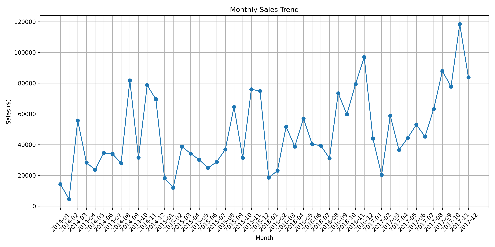
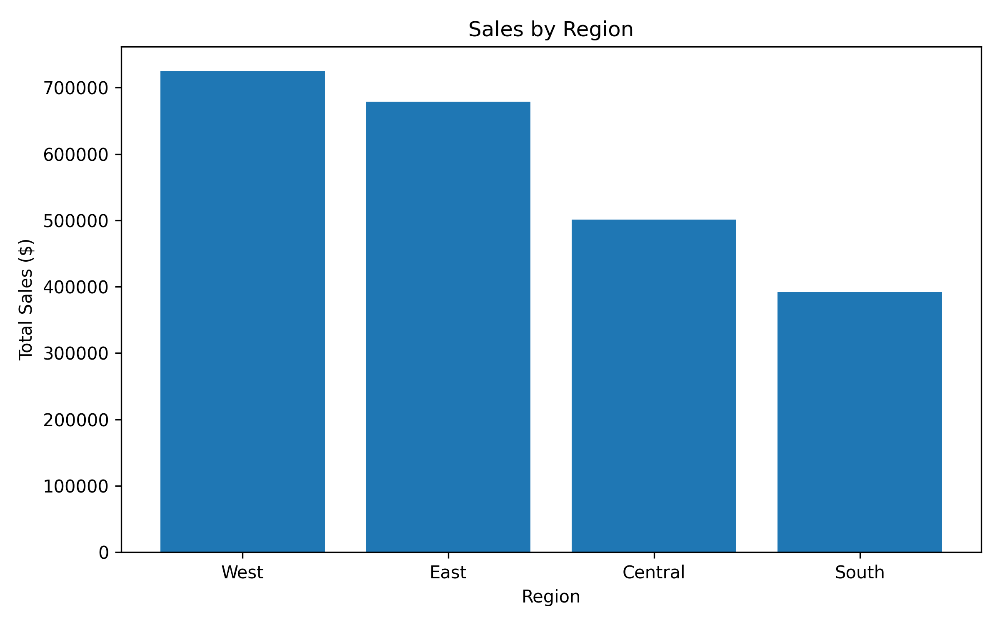
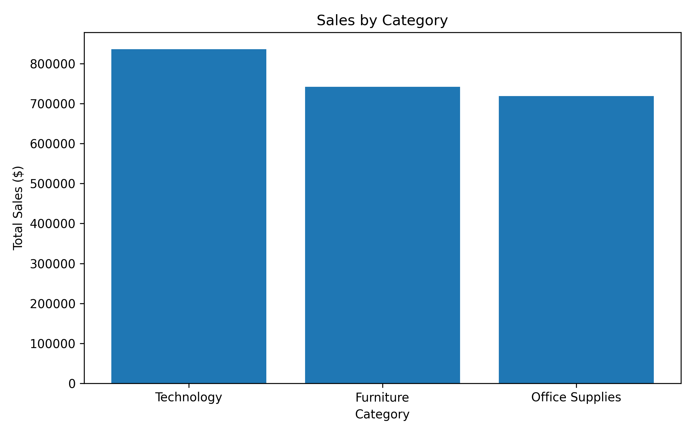
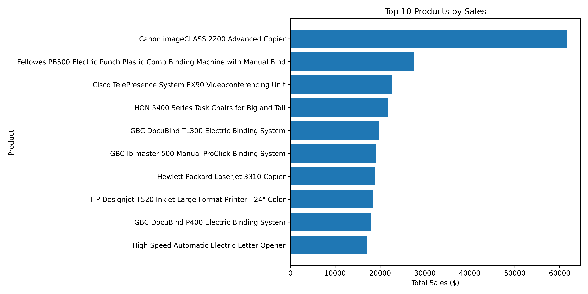
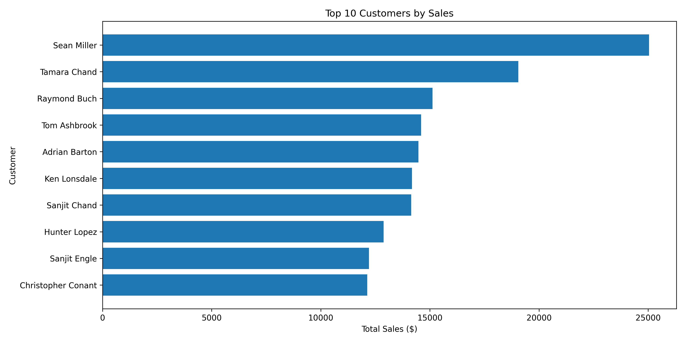
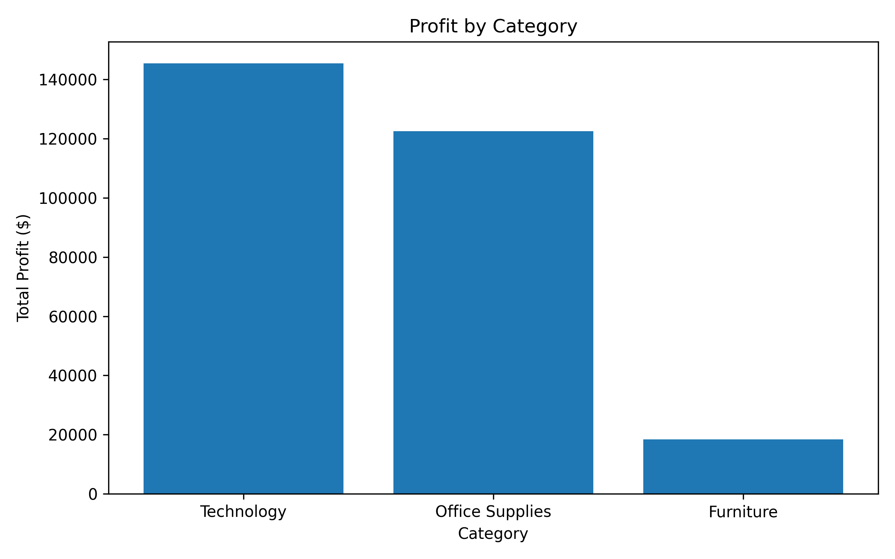

# 📊 Executive Sales Analytics Dashboard

## Overview

This project demonstrates an end-to-end Business Intelligence workflow using Python, SQL, and Power BI. It analyzes retail sales data to uncover business insights, monitor key performance indicators (KPIs), and support data-driven decision-making.

---

## Objectives

- Clean and prepare raw sales data
- Perform business analysis using SQL
- Build an interactive executive dashboard
- Generate actionable business insights

---

## Tools & Technologies

- Python (Pandas)
- SQL
- Power BI
- Git & GitHub
- Microsoft Excel

---

## Project Workflow

1. Data Collection
2. Data Cleaning (Python)
3. SQL Business Analysis
4. Dashboard Development
5. Business Insights

---

## Key Performance Indicators

- Total Sales
- Total Profit
- Total Orders
- Average Sales
- Profit Margin

---

## Dashboard Features

- Executive Overview
- Monthly Sales Trend
- Sales by Region
- Sales by Category
- Top 10 Products
- Top 10 Customers
- Interactive Filters
### Top Products Insight

The Top 10 Products analysis identifies the products contributing the highest revenue. These products should receive priority in inventory planning, promotional campaigns, and demand forecasting to maximize profitability.
---

## Repository Structure

```
Executive-Sales-Analytics-Dashboard/
│
├── Data/
├── Python/
├── SQL/
├── Dashboard/
├── Images/
└── README.md
```

---

## Business Questions Answered

- Which region generates the highest sales?
- Which products are the most profitable?
- Who are the top customers?
- How do sales change over time?
- Which categories perform best?

---
## Dashboard Preview

### Monthly Sales Trend



### Sales by Region



### Sales by Category



### Top 10 Products



### Top 10 Customers



### Profit by Category



## 🛠️ Skills Demonstrated

### Programming
- Python
- SQL

### Data Analysis
- Data Cleaning
- Exploratory Data Analysis (EDA)
- KPI Development
- Business Analysis

### Visualization
- Matplotlib
- Business Reporting

### Tools
- Google Colab
- Git
- GitHub
- Microsoft Excel

  ## 📌 Project Overview

This project demonstrates an end-to-end Business Intelligence workflow using Python, SQL, and data visualization techniques. The objective is to transform raw retail sales data into actionable business insights through data cleaning, analysis, and interactive reporting.

The project follows a real-world analytics process:
- Collect and clean raw sales data
- Analyze business performance using SQL
- Calculate key performance indicators (KPIs)
- Visualize trends and performance
- Provide business recommendations

## Author

**Adam Muhammad Albasu**

Data Analyst | Business Intelligence | SQL | Python | Power BI
